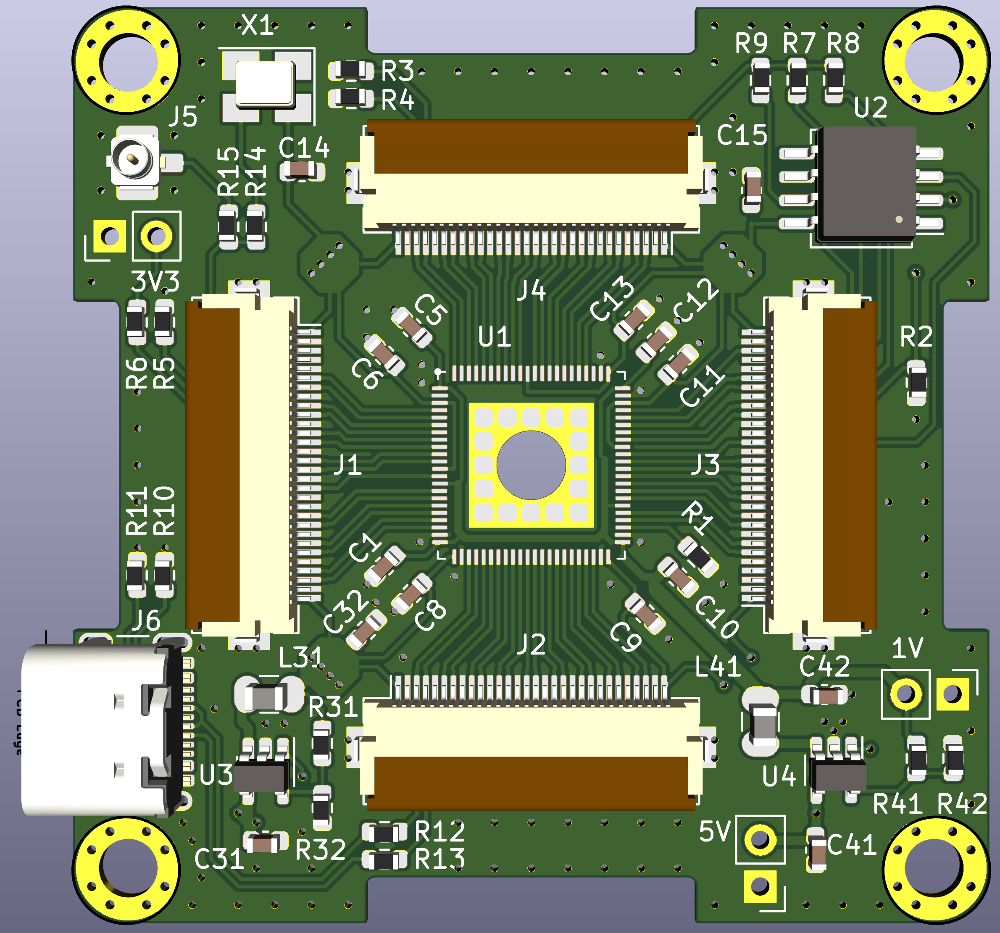

# Горынь

* GOWIN FPGA GW2AR-LV18QN88C8/I7 QN88
* 4 FFC LVDS capable connectors
* FLASH 64MiB
* 3v3, 1v0 DC-DC converters

## License

Hardware is released under the [CC BY-SA 4.0](https://creativecommons.org/licenses/by-sa/4.0/) license.
