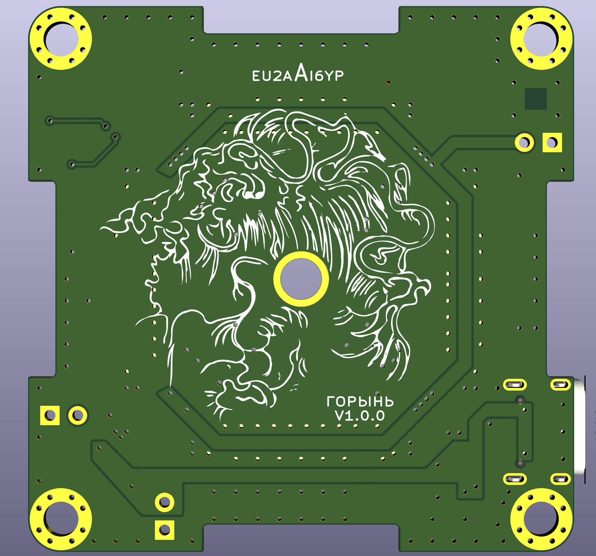
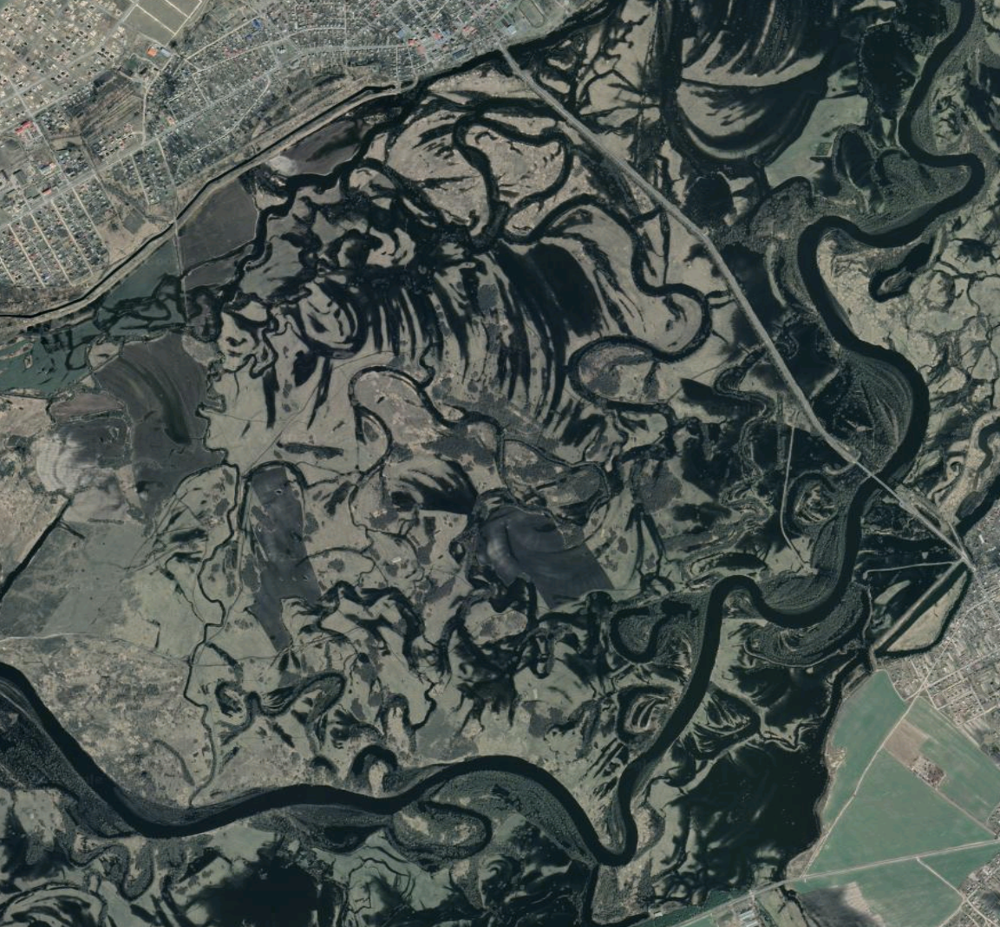

# Горынь

* GOWIN FPGA GW2AR-LV18QN88C8/I7 QN88
* 4 x 30pin FPC LVDS capable connectors
* FLASH 64MiB
* 3v3, 1v0 DC-DC converters

## BOM

https://ai6yp.github.io/goryn/ibom.html

## Goryn on the map

https://www.google.com/maps/@51.8671689,26.8422638,6338m/data=!3m1!1e3

## License

Hardware is released under the <a href="https://creativecommons.org/licenses/by/4.0/"> CC BY 4.0 </a> [[LICENSE](LICENSE)].
